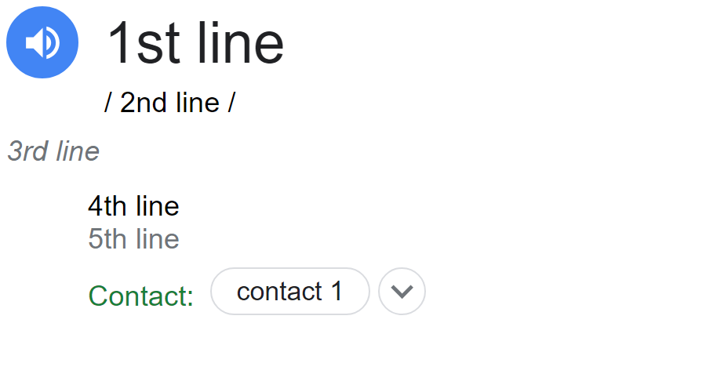

# business-card-maker
Google definition looking business card generator

## Example card

## How to
1. clone repo
2. run `main.py`
3. type in your information according to [template](#template)
4. type in output file name
5. output file will be created in [img folder](/img/)

## Template 
