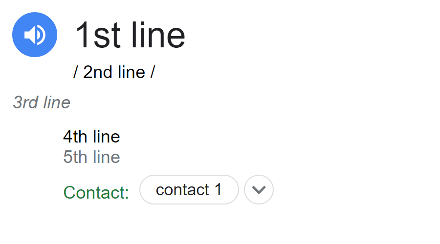

# business-card-maker
Google definition looking business card generator

## Example card

## How to
1. clone repo
2. run activate file from `Scripts/` folder
3. run `main.py`
4. type in your information according to [template](#template)
5. type in output file name
6. output file will be created in `img/`

## Template 

